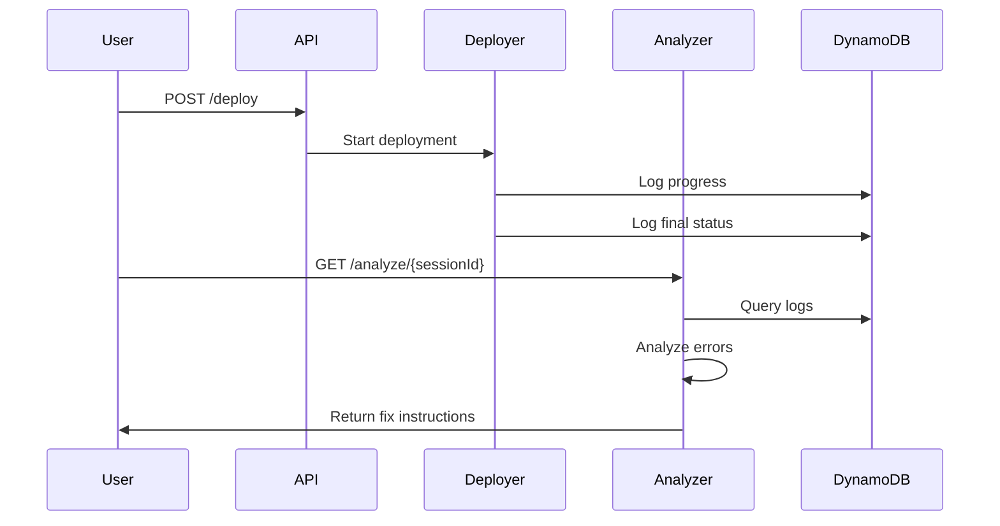

# Status Analyzer Module

The Status Analyzer is an intelligent diagnostic tool that analyzes deployment outputs from the GitHub Lambda Deployer and generates actionable fix instructions.

## Overview

This module automatically:
- Analyzes deployment logs and error messages
- Identifies root causes of failures
- Generates step-by-step fix instructions
- Provides code examples and documentation links
- Categorizes errors by severity and type

## Features

### Error Detection
The analyzer can detect and diagnose:
- **CloudFormation errors**: Stack creation failures, resource conflicts, invalid parameters
- **IAM permission issues**: Access denied, unauthorized operations
- **Lambda configuration errors**: Invalid parameters, resource conflicts
- **Git/Repository errors**: Clone failures, branch issues
- **S3 errors**: Bucket access, configuration issues
- **Template validation errors**: Syntax errors, invalid resources
- **Timeout issues**: Deployment timeouts, stack creation delays
- **Network errors**: Connectivity issues, DNS resolution
- **Resource limits**: AWS service quotas and limits

### Analysis Output

For each deployment, the analyzer provides:
- **Summary**: High-level overview of deployment status and duration
- **Error Analysis**: Detailed error categorization with severity levels (critical, high, medium, low)
- **Root Cause**: Primary reason for failure
- **Fix Instructions**: Step-by-step remediation guide with:
  - Action items
  - Code examples
  - AWS CLI commands
  - Links to documentation

## API Endpoints

### POST /analyze
Analyze a deployment by session ID and optional parameters.

**Request:**
```json
{
  "sessionId": "uuid-of-deployment",
  "repository": "https://github.com/user/repo",  // optional
  "branch": "main",                              // optional
  "rootFolder": "lambda/",                       // optional
  "stackDetails": {                              // optional
    "stackName": "my-stack"
  }
}
```

**Response:**
```json
{
  "sessionId": "uuid-of-deployment",
  "status": "failed",
  "repository": "https://github.com/user/repo",
  "branch": "main",
  "analysisTimestamp": "2024-01-15T10:30:00Z",
  "deploymentDuration": 45.2,
  "rootCause": "IAM permission denied",
  "summary": "Deployment failed after 45.2 seconds. Found 2 error(s): 1 critical, 1 high severity. See fix instructions below.",
  "errors": [
    {
      "type": "IAM_PERMISSION",
      "severity": "critical",
      "message": "IAM permission denied",
      "relatedLogs": [
        "AccessDenied: User not authorized to perform cloudformation:CreateStack"
      ]
    }
  ],
  "fixInstructions": [
    {
      "step": 1,
      "category": "IAM Permissions",
      "action": "Grant required IAM permissions",
      "details": "The deployment failed due to insufficient IAM permissions...",
      "codeExample": "{\n  \"Version\": \"2012-10-17\",\n  \"Statement\": [...]\n}",
      "documentation": "https://docs.aws.amazon.com/IAM/latest/UserGuide/access_policies.html"
    }
  ]
}
```

### GET /analyze/{sessionId}
Retrieve analysis for a specific deployment session.

**Response:** Same as POST /analyze

## Error Types

| Error Type | Severity | Common Causes |
|------------|----------|---------------|
| `IAM_PERMISSION` | Critical | Missing IAM permissions, policy restrictions |
| `GIT_CLONE` | Critical | Invalid repository, authentication issues |
| `CFN_CAPABILITIES` | Critical | Missing IAM capabilities acknowledgment |
| `LAMBDA_CONFIG` | High | Invalid handler, runtime, or configuration |
| `CFN_INVALID_PARAMETER` | High | Invalid CloudFormation parameters |
| `CFN_RESOURCE_EXISTS` | Medium | Resource name conflicts |
| `TEMPLATE_VALIDATION` | High | Syntax errors, invalid resources |
| `S3_ERROR` | High | Bucket access or configuration issues |
| `TIMEOUT` | Medium | Long-running operations, stuck resources |
| `NETWORK` | High | Connectivity, DNS, or VPC issues |
| `RESOURCE_LIMIT` | High | AWS service quotas exceeded |

## Usage Examples

### Example 1: Analyze a Failed Deployment

```bash
# Deploy a Lambda
DEPLOY_RESPONSE=$(curl -X POST https://api-url/prod/deploy \
  -H "Content-Type: application/json" \
  -d '{"repository": "https://github.com/user/repo", "branch": "main"}')

SESSION_ID=$(echo $DEPLOY_RESPONSE | jq -r '.sessionId')

# Wait for deployment to complete
sleep 30

# Analyze the deployment
curl -X GET https://api-url/prod/analyze/$SESSION_ID | jq
```

### Example 2: Analyze with Additional Context

```bash
curl -X POST https://api-url/prod/analyze \
  -H "Content-Type: application/json" \
  -d '{
    "sessionId": "abc123-def456-...",
    "repository": "https://github.com/user/my-lambda",
    "branch": "feature/new-endpoint",
    "rootFolder": "services/api/",
    "stackDetails": {
      "stackName": "my-api-stack",
      "environment": "staging"
    }
  }' | jq
```

## Fix Instruction Categories

The analyzer provides targeted fix instructions for different categories:

- **IAM Permissions**: Policy examples, role configuration
- **Lambda Configuration**: Handler format, runtime settings
- **Repository Access**: Authentication, URL format
- **CloudFormation**: Template validation, resource naming
- **S3 Storage**: Bucket policies, access configuration
- **Template**: Syntax validation, resource types
- **Performance**: Timeout settings, optimization
- **Network**: VPC configuration, security groups
- **AWS Limits**: Quota increases, service limits

## Integration with Deployment Workflow



## Development

### Building

```bash
cd lambdas/status-analyzer
npm install
npm run build
```

### Local Testing

```bash
# Build
npm run build

# Test with sample data
export DEPLOYMENTS_TABLE=YourTableName
node dist/index.js
```

## Environment Variables

- `DEPLOYMENTS_TABLE` - DynamoDB table name for deployment logs

## Dependencies

- `@aws-sdk/client-dynamodb` - DynamoDB client
- `@aws-sdk/lib-dynamodb` - DynamoDB document client
- `@types/aws-lambda` - Lambda TypeScript types

## Architecture

The analyzer operates in multiple phases:

1. **Data Collection**: Queries DynamoDB for all deployment records
2. **Error Detection**: Scans logs for error patterns
3. **Categorization**: Groups errors by type and severity
4. **Root Cause Analysis**: Identifies primary failure reason
5. **Fix Generation**: Creates actionable remediation steps
6. **Response Formatting**: Returns structured JSON with instructions

## Best Practices

- Always analyze failed deployments to understand issues
- Use fix instructions as a starting point, adapt to your specific case
- Check AWS documentation links for detailed guidance
- Monitor deployment duration to identify performance issues
- Review all errors, not just critical ones

## Future Enhancements

Planned features:
- AI-powered analysis using AWS Bedrock
- Historical trend analysis
- Automated fix application
- Integration with ticketing systems
- Custom rule configuration
- Multi-region support
- Cost analysis for failed deployments

## Troubleshooting

### Analyzer returns no errors but deployment failed
- Check if logs contain unrecognized error patterns
- Review DynamoDB records manually
- File an issue with the error logs

### Analysis takes too long
- Deployment has many log entries
- Increase Lambda memory/timeout in CDK stack

### Missing deployment session
- Verify session ID is correct
- Check DynamoDB table for the record
- Ensure deployment was initiated successfully

## License

MIT
